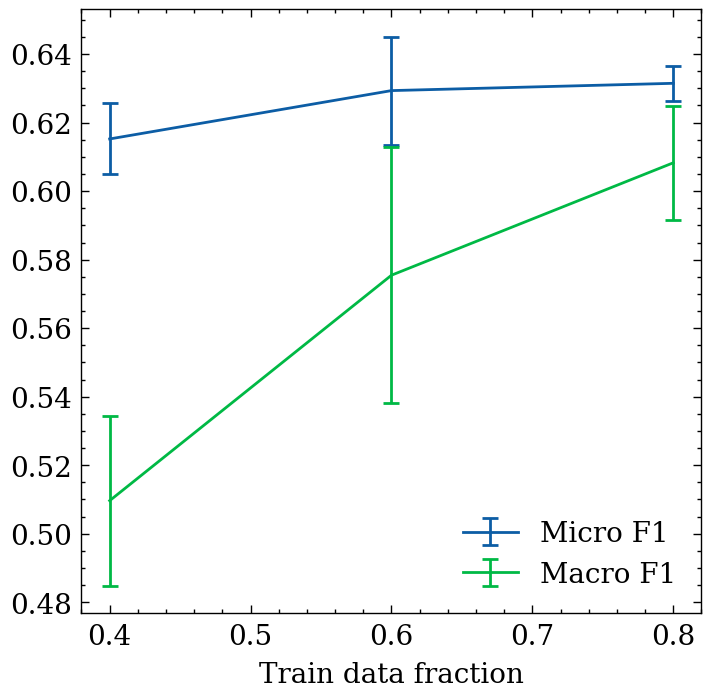

# Web Genre Identification Experiments on the GINCO Dataset

This repository contains the code used in the experiments presented in:

[Kuzman, Taja, Peter Rupnik, and Nikola Ljubešić. "The GINCO Training Dataset for Web Genre Identification of Documents Out in the Wild." Proceedings of the Thirteenth Language Resources and Evaluation Conference. 2022.](https://aclanthology.org/2022.lrec-1.170/)

## Overview and Resources

We introduce and evaluate GINCO 1.0, a manually-annotated dataset for automatic genre identification of Slovenian web documents. The repository implements:
- dataset preprocessing and splits
- model training and evaluation for genre classification
- experimental setups corresponding to Sections 4.3–4.7 of the paper

The majority of the original code has been prepared by Peter Rupnik. The code and the repository have then been edited by Taja Kuzman Pungeršek.

We use the following resources:
- newly developed manually-annotated [Genre Identification Corpus GINCO 1.0](http://hdl.handle.net/11356/1467) (Kuzman et al., 2021)
- genre annotation guidelines, publicly available at 
https://tajakuzman.github.io/GINCO-Genre-Annotation-Guidelines/
- the following models were evaluated:
	- stratified dummy classifier
	- [fastText](https://fasttext.cc/)
	- fastText with [pre-trained Slovenian embeddings](http://hdl.handle.net/11356/1204)
	- [SloBERTa 2.0 BERT-like model](http://hdl.handle.net/11356/1397), available also on [Hugging Face](https://huggingface.co/EMBEDDIA/sloberta)
	- [XLM-RoBERTa (base size)](https://huggingface.co/FacebookAI/xlm-roberta-base) BERT-like model

The data, used for the experiments, is located in the *data* folder. The data was prepared according to the code in [code/1_data_preparation_downsampling_stratification.ipynb](code/1_data_preparation_downsampling_stratification.ipynb) and [code/2_data_preparation_FastText.ipynb](code/2_data_preparation_FastText.ipynb).

## Main Results

The tables and plots below summarize the main classification results reported in the paper (micro F1 and macro F1 on the test set).

The code for the result analysis is available in:
- [code/7_result_analysis.ipynb](code/7_result_analysis.ipynb)
- [code/7_additional_result_analysis.ipynb](code/7_additional_result_analysis.ipynb)
- [code/7_paper_plots_and_tables.ipynb](code/7_paper_plots_and_tables.ipynb)
- [code/7_result_analysis_stat-significance.ipynb](code/7_result_analysis_stat-significance.ipynb)

### Choice of Technology (Section 4.3)

| Model | Micro F1 | Macro F1 |
|------|----------|----------|
| Stratified dummy | 0.067 | 0.061 |
| fastText | 0.352 ± 0.038 | 0.217 ± 0.040 |
| fastText + embeddings | 0.361 ± 0.007 | 0.219 ± 0.013 |
| XLM-RoBERTa | 0.624 ± 0.015 | 0.579 ± 0.024 |
| SloBERTa | 0.629 ± 0.016 | 0.575 ± 0.037 |

Code for training and evaluating classifiers:
- [code/3_experiments_with_FastText.ipynb](code/3_experiments_with_FastText.ipynb)
- [code/4_dummy_classifier.ipynb](code/4_dummy_classifier.ipynb)
- [code/6_training_xlm_roberta.ipynb](code/6_training_xlm_roberta.ipynb)
- [code/6-training-SloBERTa.ipynb](code/6-training-SloBERTa.ipynb)

### Impact of Near-Duplicate Removal (Section 4.4)

| Dataset | Micro F1 | Macro F1 |
|--------|----------|----------|
| Full texts | 0.607 ± 0.019 | 0.596 ± 0.033 |
| Deduplicated | 0.629 ± 0.016 | 0.575 ± 0.037 |

See the code for analysis.

### Impact of Training Data Size (Section 4.5)

Training with larger fractions of the dataset improves both micro and macro F1, with diminishing returns after 80%.

Code: [code/Section-4.5-training_and_analysis.ipynb](code/Section-4.5-training_and_analysis.ipynb)

### Secondary Labels as Additional Signal (Section 4.6)

Including secondary labels yields no consistent improvement and slightly degrades macro F1.

|Train labels | Micro F1 | Macro F1 |
|----------|----------|----------|
|primary | 0.629 ± 0.016| 0.575 ± 0.037 |
|both | 0.635 ± 0.011| 0.558 ± 0.026|

- code: [code/Section-4.6-training.ipynb](code/Section-4.6-training.ipynb)

### Reduced Label Set (Section 4.7)

| Label set | Micro F1 | Macro F1 |
|----------|----------|----------|
| 21 labels | 0.629 ± 0.016 | 0.575 ± 0.037 |
| 12 labels | 0.696 ± 0.011 | 0.668 ± 0.028 |

- code: [code/Section-4.7-training_and_analysis.ipynb](code/Section-4.7-training_and_analysis.ipynb)

## Citation

If you use this code, please cite the paper:

[Kuzman, Taja, Peter Rupnik, and Nikola Ljubešić. "The GINCO Training Dataset for Web Genre Identification of Documents Out in the Wild." Proceedings of the Thirteenth Language Resources and Evaluation Conference. 2022.](https://aclanthology.org/2022.lrec-1.170/)

## Acknowledgments

This work has received funding from the European Union’s Connecting Europe Facility 2014-2020 - CEF Telecom, under Grant Agreement No. INEA/CEF/ICT/A2020/2278341. This communication reflects only the author’s view. The Agency is not responsible for any use that may be made of the information it contains.

This work was also funded by the Slovenian Research Agency within the Slovenian-Flemish bilateral basic research project ”Linguistic landscape of hate speech on social media” (N06-0099 and FWO-G070619N, 2019–2023) and the research programme “Language resources and technologies for Slovene” (P6-0411).